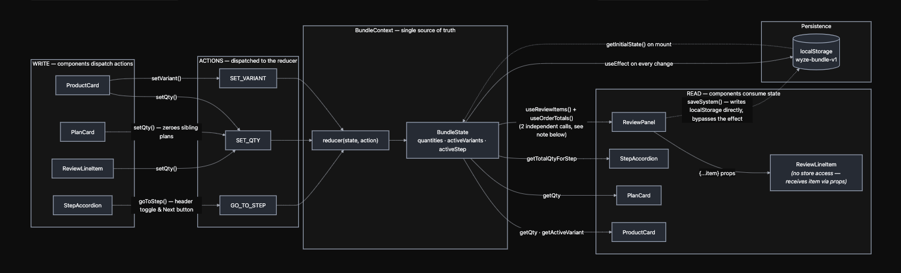

# Wyze Bundle Builder — Documentation (Test ID 43102)

## Quick walkthrough for the submission 😁

 

[Watch the video](https://www.youtube.com/watch?v=vXk0QIlRurA)


## 1. Running locally

Requirements: Node 18+ (tested on Node 26), npm.

```bash
npm install
npm run dev       # starts Vite dev server with HMR
```

Other scripts:

```bash
npm run build      # tsc -b && vite build → dist/
npm run preview    # serve the production build locally
npm run lint        # oxlint
```

No environment variables or backend service are required — all product/plan data is static, defined in `src/data/`.

## 2. Design system

Tokens live in `src/index.css`, structured in two layers.

### Primitives

Raw values with no meaning attached — colors, font sizes, spacing, radii, etc.

```css
--color-purple-500: #4E2FD2;
--color-gray-900: #1F1F1F;
--font-size-16: 1rem;
--space-12: 0.75rem;
--radius-10: 0.625rem;
--letter-spacing-md: 1.6px;
```

### Semantic tokens

Named by role, referencing primitives. These are what components should use.

```css
--color-brand-primary: var(--color-purple-500);
--color-text-heading: var(--color-gray-900);
--color-border-card: var(--color-gray-300);
--radius-card: var(--radius-10);
--spacing-inset-md: var(--space-15);
```

Semantic color tokens are also exposed as Tailwind theme colors via `@theme` (e.g. `--color-brand`, `--color-heading`, `--color-muted-text`), so components can use utilities like `text-heading` or `border-card-border` directly.

### Typography utilities

Composite text styles (family + weight + size + line-height + letter-spacing) are defined once as `@utility` classes and applied as single classNames, e.g.:

```css
@utility font-plan-title {
  font-family: var(--font-gilroy-medium);
  font-weight: var(--font-weight-bold);
  font-size: var(--font-size-24);
  line-height: var(--line-height-120);
  ...
}
```

```tsx
<h2 className="font-plan-title">Cam Unlimited</h2>
```

### Everything else

Layout is done with Tailwind utility classes directly in JSX. A small set of scoped plain-CSS classes remain for pieces where Tailwind's cascade fights the design (`.card`, `.variant-chip`, `.stepper-btn`, `.btn-checkout`, etc.) — these consume the same design tokens via CSS variables rather than hardcoded values.

## 3. Data flow

`src/data/products.ts` defines the static catalog (`PRODUCTS: Product[]`) and initial selection state (`INITIAL_QUANTITIES`, `INITIAL_ACTIVE_VARIANTS`). `src/data/steps.ts` defines the ordered wizard steps, each tied to a product `category`.

`BundleContext` (`src/context/BundleContext.tsx`) owns all mutable state via `useReducer`:

- `quantities: { [productId]: { [variantId]: qty } }`
- `activeVariants: { [productId]: variantId }`
- `activeStep: number`

State initializes from `localStorage` (`wyze-bundle-v1`) if present, otherwise from the `INITIAL_*` data, and is persisted back to `localStorage` on every change via `useEffect` and if user explicitly clicked "Save my system for late".

Added an extra shipping logic, where users gets a free shipping on oreders above $100 only. And it's a flat fee of $5.99.
### Diagram:

